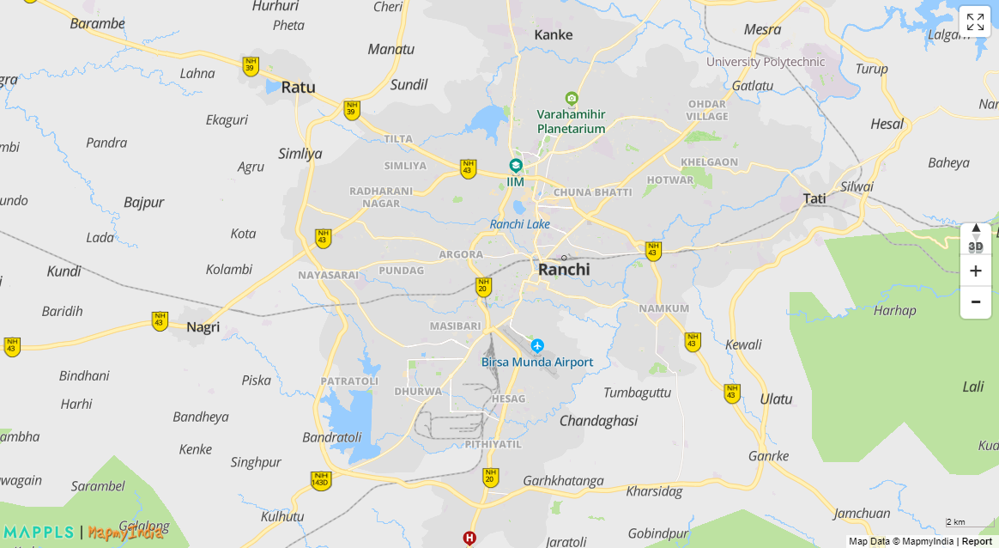
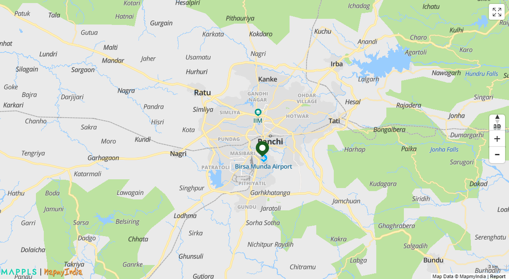
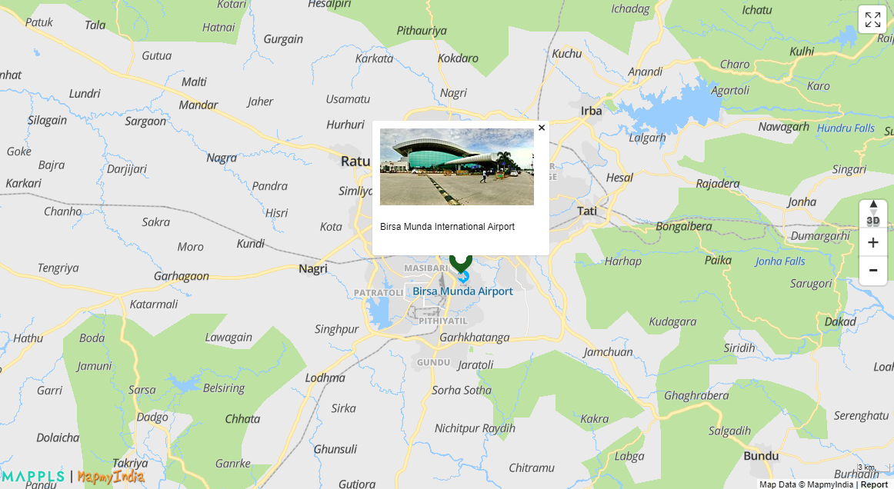
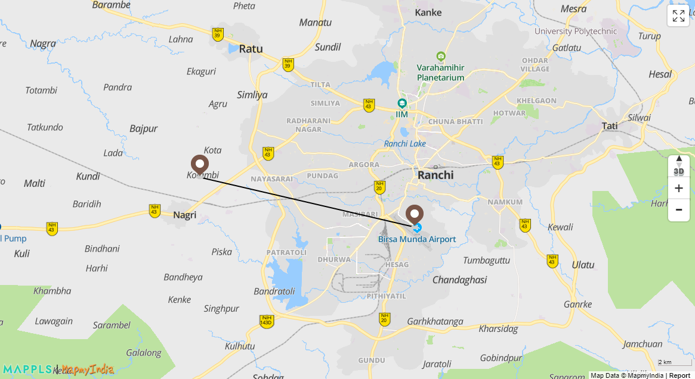
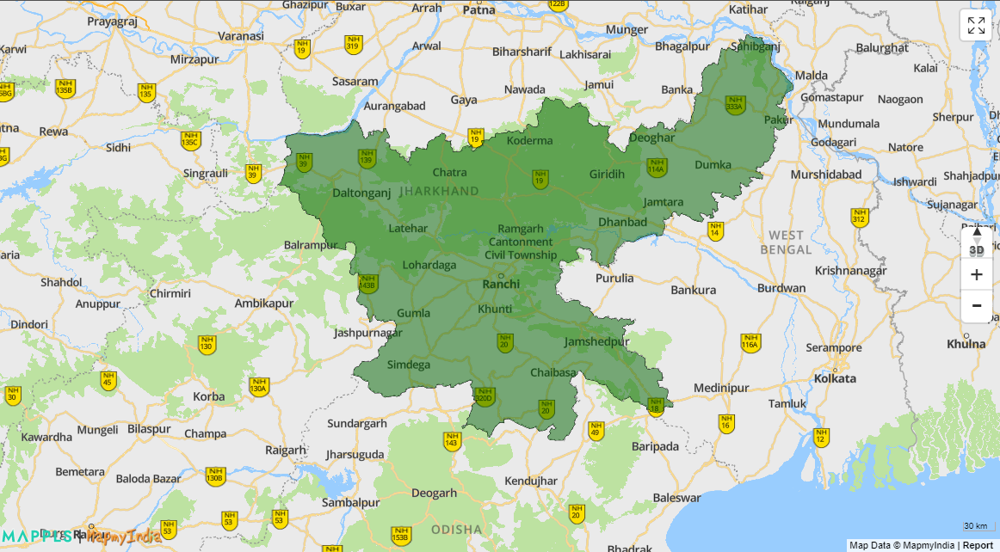
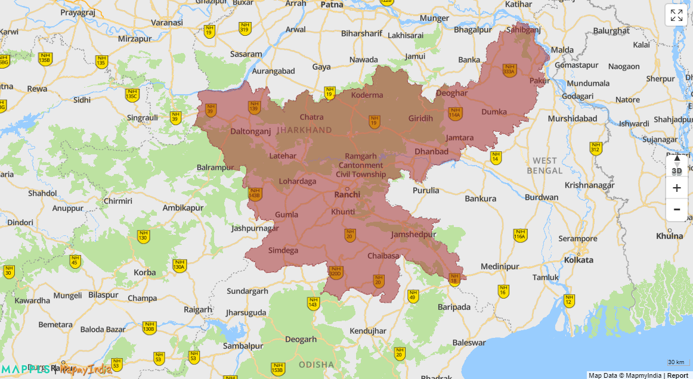
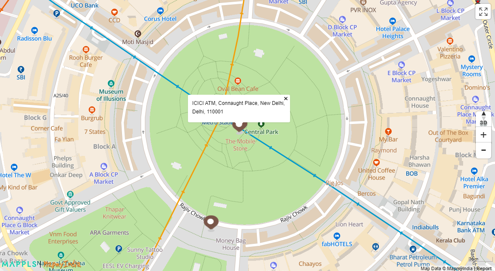

- [Section 1](#section-1)
    - [How to integrate Mappls SDKs?](#how-to-integrate-mappls-sdks)
    - [How does it initialize Mappls SDKs?](#how-does-it-initialize-mappls-sdks)
    - [How to show a popup on click of Map Marker?](#how-to-show-a-popup-on-click-of-map-marker)
- [Section 2](#section-2)
    - [How to show Mappls Map?](#how-to-show-mappls-map)
    - [How to set zoom level and center of Map?](#how-to-set-zoom-level-and-center-of-map)
    - [How to plot a marker on Mappls Map?](#how-to-plot-a-marker-on-mappls-map)
    - [Add a custom marker and when we click on the marker then display an InfoWindow/pop-up.](#add-a-custom-marker-and-when-we-click-on-the-marker-then-display-an-infowindowpop-up)
    - [Add 50 custom markers and when we click on a particular marker, the marker should be highlighted](#add-50-custom-markers-and-when-we-click-on-a-particular-marker-the-marker-should-be-highlighted)
    - [How to plot a polyline on Mappls Map?](#how-to-plot-a-polyline-on-mappls-map)
    - [How to plot a polyline with custom color on Mappls Map?](#how-to-plot-a-polyline-with-custom-color-on-mappls-map)
- [Section 3](#section-3)
    - [How to get human readable address information at a location/coordinate?](#how-to-get-human-readable-address-information-at-a-locationcoordinate)
    - [How to get details of a place by its name?](#how-to-get-details-of-a-place-by-its-name)
    - [How to get road distance between two locations?](#how-to-get-road-distance-between-two-locations)
    - [How to get nearby places from a location of some specific category?](#how-to-get-nearby-places-from-a-location-of-some-specific-category)

## Section 1: 

### How to integrate Mappls SDKs?
* Install mappls sdk 
    ```
    npm  i  mappls-web-maps
    ```

### How does it initialize Mappls SDKs?
* Import mappls package into the component where map needs to be rendered
    ```typescript
    import { mappls, mappls_plugin } from 'mappls-web-maps';
    ```
* Declare variables and call the initialize function to initialize the map
    ```typescript
    mapObject: any;
    mapplsClassObject: any = new mappls()
    mapplsPluginObject: any = new mappls_plugin()

    ngOnInit() {
        const loadObject = {
            map: true,
            layer: 'vector',
            libraries: ['airspacelayers'],
        };
        this.mapplsClassObject.initialize('<token>', loadObject,
        () => {
            this.mapObject = this.mapplsClassObject.Map(
            {
                id: 'map',
                properties: {
                    center: [23.3441, 85.3096],
                    zoomControl: true,
                    location: true,
                },
            },
            )
        })
      }

    ```

### How to show a popup on click of Map Marker?
* After intializing the map, add a marker when map has been loaded.Give the coordinates where you want to place marker as `position`. Define the popup's html code as the `popupHtml`
    ```typescript
    markerObject: any;    
    this.mapplsClassObject.initialize('<token>', loadObject,
    () => {
        this.mapObject = this.mapplsClassObject.Map(
        {
            id: 'map',
            properties: {
                center: [23.3441, 85.3096],
                zoomControl: true,
                location: true,
            },
        },
        )
        this.mapObject.on("load", () => {
            this.markerObject = this.mapplsClassObject.Marker({
                map: this.mapObject,
                position: { lat: 23.317725, lng: 85.323597 },
                popupHtml: "<p>Birsa Munda International Airport</p>"
            });
        });
    });
    ```
* Add a div with id "map" in the html template to render the map
    ```html
    <div id="map"></div>
    ```


---

## Section 2: 

### How to show Mappls Map?
* Import mappls package into the component where map needs to be rendered
    ```typescript
    import { mappls, mappls_plugin } from 'mappls-web-maps';
    ```
* Declare variables and call the initialize function to initialize the map. Inside initialize function call Map function passing json including the html id, properties, etc as parameter.
    ```typescript
    mapObject: any;
    mapplsClassObject: any = new mappls()
    mapplsPluginObject: any = new mappls_plugin()

    ngOnInit() {
        const loadObject = {
            map: true,
            layer: 'vector',
            libraries: ['airspacelayers'],
        };
        this.mapplsClassObject.initialize('<token>', loadObject,
        () => {
            this.mapObject = this.mapplsClassObject.Map(
            {
                id: 'map',
                properties: {
                    zoomControl: true,
                    location: true,
                },
            },
            )
        })
      }

    ```
* Add a div with id "map" in the html template to render the map
    ```html
    <div id="map"></div>
    ```


### How to set zoom level and center of Map?
* Inside properties give the center coordinates as `center` and zoom level as `zoom`.
    ```typescript
    mapObject: any;
    mapplsClassObject: any = new mappls()
    mapplsPluginObject: any = new mappls_plugin()

    ngOnInit() {
        const loadObject = {
            map: true,
            layer: 'vector',
            libraries: ['airspacelayers'],
        };
        this.mapplsClassObject.initialize('<token>', loadObject,
        () => {
            this.mapObject = this.mapplsClassObject.Map(
            {
                id: 'map',
                properties: {
                    center: [23.3441, 85.3096],
                    zoomControl: true,
                    location: true,
                    zoom:
                },
            },
            )
        })
      }

    ```


### How to plot a marker on Mappls Map?
* Add a marker when map has been loaded by calling the `Marker` function. Give the coordinates where you want to place marker as `position`.
    ```typescript
    markerObject: any;    
    this.mapplsClassObject.initialize('<token>', loadObject,
    () => {
        this.mapObject = this.mapplsClassObject.Map(
        {
            id: 'map',
            properties: {
                center: [23.3441, 85.3096],
                zoomControl: true,
                location: true,
            },
        },
        )
        this.mapObject.on("load", () => {
            this.markerObject = this.mapplsClassObject.Marker({
                map: this.mapObject,
                position: { lat: 23.317725, lng: 85.323597 },
                popupHtml: "<p>Birsa Munda International Airport</p>"
            });
        });
    });
    ```


### Add a custom marker and when we click on the marker then display an InfoWindow/pop-up.
* Add a marker when map has been loaded. Give the coordinates where you want to place marker as `position`.Give the path/url of marker icon as `icon` to set a custom marker. Define the popup's html code as the `popupHtml`
    ```typescript
    this.mapObject.on("load", () => {
        this.markerObject = this.mapplsClassObject.Marker({
            map: this.mapObject,
            icon:  'https://apis.mapmyindia.com/map_v3/2.png',
            position: { lat: 23.317725, lng: 85.323597 },
            popupHtml: "<style>::-webkit-scrollbar {width: 10px;} </style><div style=\"max-height:150px;min-width:200px;overflow-y: scroll;\">" +
            ""+
            "<p>Birsa Munda International Airport</p>" +
            "<a href=\"https://www.mappls.com\">Mappls Maps</a></div>",
        });
    });
    ```



### Add 50 custom markers and when we click on a particular marker, the marker should be highlighted
* Add a variable with geojson of the points to be plotted
    ```typescript
      airportsGeojson = {
        "type": "FeatureCollection",
        "features": [
          {
            "type": "Feature",
            "geometry": {
              "type": "Point",
              "coordinates": [
                8.4819569,
                76.9196331
              ]
            },
            "properties": {
              "name": "Thiruvananthapuram International Airport",
              "name_en": "Thiruvananthapuram International Airport",
              "name_fr": null,
                }
          }
        ]
      };
    ```
* Add this variable as `position` of marker
    ```typescript
    this.mapObject.on("load", () => {
        this.markerObject = this.mapplsClassObject.Marker({
            map: this.mapObject,
            position: this.airportsGeojson,
            width: 6,
            height: 8,
            icon: 'https://cdn4.iconfinder.com/data/icons/ionicons/512/icon-plane-512.png',
            clusters: true,
            fitbounds: true,
        });
       });
    ```


### How to plot a polyline on Mappls Map?
* Declare a variable containing polyline data.
    ```typescript
    polylineData = {
        "type": "FeatureCollection",
        "features": [
            {
                "type": "Feature",
                "geometry": {
                "type": "LineString",
                "coordinates": [
                    [85.2000, 23.3441],
                    [85.323597, 23.317725]
                    ]
                },
            "properties": {
                "name": "Ranchi Airport to Ranchi High Court"
            }
            }
        ]
    };
    ```
* Add polyline using `Polyline` function and define polyline coordinates as `path`
    ```typescript
    this.polylineObject = this.mapplsClassObject.Polyline(
        {
            map: this.mapObject,
            path: this.polylineData,
        }
    );
    ```


### How to plot a polyline with custom color on Mappls Map?
* Set color using `strokeColor` 
    ```typescript
    this.polylineObject = this.mapplsClassObject.Polyline(
        {
            map: this.mapObject,
            path: this.polylineData,
            strokeColor:  'green',
        }
    );
    ```


### How to plot a polygon on Mappls Map?
* Add polygon using `Polygon` function and define polygon coordinates as `paths`
    ```typescript
    this.polygonObject = this.mapplsClassObject.Polygon(
        {
            map: this.mapObject,
            paths: [
                {
                "lng": 83.49816893219469, "lat": 24.52705948102653
                },
                {
                "lng": 83.54244234437463, "lat": 24.5261803947958
                },
                {
                "lng": 83.60015868279078, "lat": 24.513240765593967
                },
                {
                "lng": 83.68245698049178, "lat": 24.51558118890164
                },
            ]
        }
    );
    ```


### How to plot a polygon with custom color?
*   Set fill color using `fillColor` and border color using `strokeColor`
    ```typescript
    this.polygonObject = this.mapplsClassObject.Polygon(
        {
            map: this.mapObject,
            paths: [
                {
                "lng": 83.49816893219469, "lat": 24.52705948102653
                },
                {
                "lng": 83.54244234437463, "lat": 24.5261803947958
                },
                {
                "lng": 83.60015868279078, "lat": 24.513240765593967
                },
                {
                "lng": 83.68245698049178, "lat": 24.51558118890164
                },
            ],
            fillColor: "brown",
            strokeColor: "brown",
        }
    );
    ```

### How to plot a polygon with opacity?
*   Set fill opacity using `fillOpacity` and border opacity using `strokeOpacity`
    ```typescript
    this.polygonObject = this.mapplsClassObject.Polygon(
        {
            map: this.mapObject,
            paths: [
                {
                "lng": 83.49816893219469, "lat": 24.52705948102653
                },
                {
                "lng": 83.54244234437463, "lat": 24.5261803947958
                },
                {
                "lng": 83.60015868279078, "lat": 24.513240765593967
                },
                {
                "lng": 83.68245698049178, "lat": 24.51558118890164
                },
            ],
            fillColor: "brown",
            fillOpacity: 0.5,
            strokeColor: "brown",
            strokeOpacity: 1,
        }
    );
    ```


### How to show a custom popup on click of Map Marker?
* Add a marker when map has been loaded. Give the coordinates where you want to place marker as `position`.Give the path/url of marker icon as `icon` to set a custom marker. Define the popup's html code as the `popupHtml`
    ```typescript
    this.mapObject.on("load", () => {
        this.markerObject = this.mapplsClassObject.Marker({
            map: this.mapObject,
            icon:  'https://apis.mapmyindia.com/map_v3/2.png',
            position: { lat: 23.317725, lng: 85.323597 },
            popupHtml: "<style>::-webkit-scrollbar {width: 10px;} </style><div style=\"max-height:150px;min-width:200px;overflow-y: scroll;\">" +
            ""+
            "<p>Birsa Munda International Airport</p>" +
            "<a href=\"https://www.mappls.com\">Mappls Maps</a></div>",
            popupOptions:
            {
                openPopup: true,
                autoClose: true,
            }
        });
    });
    ```


---

## Section 3: 

### How to get human readable address information at a location/coordinate?
* Before using the Plugin in the your solution, please ensure that the related access is enabled in the Mappls Console, in the same project you set up for the Maps SDK.
Copy and paste the generated access token generated using Token Generation API.
The access token is a valid by default for 24 hours from the time of generation.

* Add an input tag in the html template. Define an id for it to provide it to the search plugin as parameter.
    ```html
    <input type="text" 
    id="auto" 
    name="auto" 
    placeholder="Search places or eLoc's..." 
    required="" 
    spellcheck="false" />
    ```

* Add `search` plugin to search about a location. The address of the location is provided as `data[0].placeName` and `data[0].placeAddress`.
    ```typescript
    callback: any;
    data: any;

    this.mapplsClassObject.initialize(
      '<access-token>',
      loadObject,
      () => {
        this.mapObject = this.mapplsClassObject.Map(
          {
            id: 'map',
            properties: {
              zoomControl: true,
              location: true,
            },
          },
        )
        var optional_config = {
          location: [28.61, 77.23],
          region: 'IND',
          height: 300,
        };
        this.mapplsPluginObject.search(
          document.getElementById('auto'),
          optional_config,
          this.callback
        );

      }
    );

    this.callback = (data: any) => {
      console.log(data);
      console.log(data[0].placeName + ", " + data[0].placeAddress);
    };
    ```


* Add a marker at that position using the `pinMarker` plugin. The `eLoc` of searched location is passed as `pin` for the pinMarker.
    ```typescript
     this.markerObject = this.mapplsPluginObject.pinMarker({
        map: this.mapObject,
        pin: data[0].eLoc,
        width: 25,
        height: 40,
        popupHtml: data[0].placeName + ", " + data[0].placeAddress,
        popupOptions: {
          openPopup: true
        },
      }, (data: any) => {
        this.markerObject = data;
        this.markerObject.fitbounds();
      });
      ```


### How to get details of a place by its name?
* The `getPinDetails` plugin can be used to get details about any `eloc` location. The `eLoc` of searched location is passed as `pin` for the getPinDetails.
    ```typescript
    var elocObj = this.mapplsPluginObject.getPinDetails(
        { pin: data[0].eLoc },
        (e: any) => {
          console.log(e);
        }
      );
    ```


### How to get road distance between two locations?
* The `direction` plugin can be used to get route and distance between two points. The start and end locations are passed inside the parameter of the plugin as `start` and `end`.
    ```typescript
    this.mapObject.on('load', () => {
        var direction_option = {
            Resource: 'route_eta',
            annotations: 'nodes,congestion',
            map: this.mapObject,
            start: { label: 'Indira Gandhi Domestic Airport, Indira Gandhi International Airport, Thimayya Marg, New Delhi, Delhi, 110037', geoposition: 'KW8FBK' },
            end: { label: 'MapmyIndia Head Office New Delhi, 237, Okhla Industrial Estate Phase 3, Near Modi Mill, New Delhi, Delhi, 110020', geoposition: 'MMI000' },
        };
        this.mapplsPluginObject.direction(direction_option, (e: any) => {
            console.log(e);
        });
    ```


### How to get nearby places from a location of some specific category?
* The `nearby` plugin can be used to search for nearby places around any particular location using keywords like 'atm','food' etc. The location coordinates is passed as `refLocation` and keywords for searching as `keywords`
    ```typescript
      var options = {
          divId: 'nearby_search',
          keywords: 'atm',
          refLocation: '28.632735,77.219696',
          fitbounds: true,
          icon: {
            url: 'https://apis.mappls.com/map_v3/1.png',
          },
          click_callback: function (d: any) {
            if (d) {
              var l =
                'Name: ' +
                d.placeName +
                '\nAddress: ' +
                d.placeAddress +
                '\neLoc: ' +
                d.eLoc;
              alert(l);
            }
          },
        };
        this.mapplsPluginObject.nearby(options, (data: any) => {
          let nr = data;
          console.log(nr);
          for (let point of nr.data) {
            this.marker = this.mapplsPluginObject.pinMarker({
              map: this.mapObject,
              pin: point.eLoc,
              popupHtml: point.placeName + ", " + point.placeAddress,
            })
          }
        });
    ```
* Add a div in html template and pass its id as `divId` to show the nearby locations.
    ```html
    <div id="nearby_search"></div>
    ```


